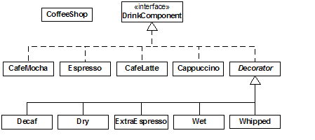
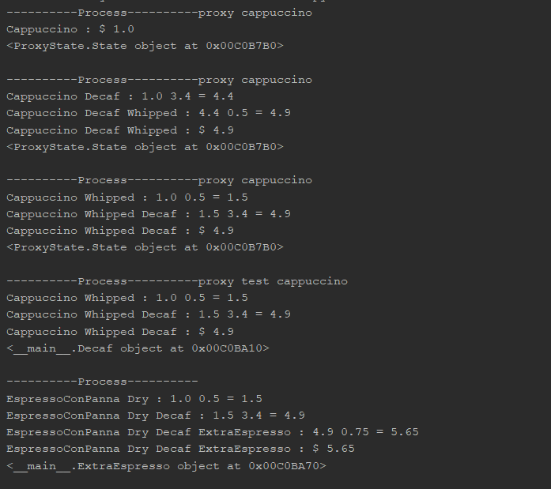

# IPP
<details>
<summary> <b>Lab1</b> - Creational Patterns
</summary>
 
## Creational Patterns
- Abstract Factory
- Factory
- Singleton

## Abstract factory and Factory
MicrosoftServiceFactory and AppleServiceFactory(concrete factories) → Service factory(abstract factory)
```python3
class ServiceFactory:
    def getHumanResources(self): pass

    def getApplications(self): pass

    def getDelivery(self): pass


class MicrosoftServiceFactory(ServiceFactory):
    def getHumanResources(self):
        return MicrosoftHumanResources()

    def getApplications(self):
        return MicrosoftApplications()

    def getDelivery(self):
        return MicrosoftDelivery()


class AppleServiceFactory(ServiceFactory):
    def getHumanResources(self):
        return AppleHumanResources()

    def getApplications(self):
        return AppleApplications()

    def getDelivery(self):
        return AppleDelivery()
```
## Singleton
Creates only a single instance of of an object
```python3
class Singleton(type):
    def __init__(cls, name, bases, attrs, **kwargs): # __init__(cls,...) where cls is classself 
        super().__init__(name, bases, attrs) 
        #The super function is used to gain access to inherited methods –
        #from a parent or sibling class – that has been overwritten in a class object.
        cls._instance = None

    def __call__(cls, *args, **kwargs): # __call__() call operator
        if cls._instance is None:
            cls._instance = super().__call__(*args, **kwargs)
        return cls._instance
```


```python3
class MicrosoftApplications(Service, metaclass=Singleton):
    def __init__(self):
        Service.__init__(self, "Microsoft", "Applications")


class MicrosoftDelivery(Service, metaclass=Singleton):
    def __init__(self):
        Service.__init__(self, "Microsoft", "Delivery")
```
The marked addresses of the object prove the Single instance of an object
</details>
<details>
<summary> <b>Lab2</b> - Structural design patterns & Behavioral design patterns
</summary>
 
## Structural design patterns & Behavioral design patterns
- Proxy
- State
- Decorator

## Proxy with States

Here i incapsulate the implementation and return a proxy of that implementatioon.
```python3
class Proxy:
    def __init__(self, imp):
        self.__implementation = imp

    def __getattr__(self, name):
        return getattr(self.__implementation, name)

```
After what, i take the implementation from proxy and change the implementation without losing the object memory allocation in another sense we just change the *state*.
```python3
class State(Proxy):
    def __init__(self, imp):
        super().__init__(imp)

    def changeImp(self, newImp):
        super().__init__(newImp)

    def __getattr__(self, name):
        return super().__getattr__(name)
```
## Decorator
In the following diagram i try to describe a coffee and the variations that can be applied to it also i will add the implemented object in a proxy:

{align='center'}

```python3
print('----------Process----------proxy cappuccino')
cappuccino = ProxyState.State(Cappuccino())
print(cappuccino.getDescription(), ": $", cappuccino.getTotalCost())
print(cappuccino.__repr__())
print()
print('----------Process----------proxy cappuccino')
cappuccino.changeImp(Whipped(Decaf(Cappuccino())))
print(cappuccino.getDescription(), ": $", cappuccino.getTotalCost())
print(cappuccino.__repr__())
print()
print('----------Process----------proxy cappuccino')
cappuccino.changeImp(Decaf(Whipped(Cappuccino())))
print(cappuccino.getDescription(), ": $", cappuccino.getTotalCost())
print(cappuccino.__repr__())
print()
print('----------Process----------proxy test cappuccino')
test = Decaf(Whipped(Cappuccino()))
print(test.getDescription(), ": $", test.getTotalCost())
print(test.__repr__())
print()
print('----------Process----------')
Hyper = ExtraEspresso(Decaf(Dry(EspressoConPanna())))
print(Hyper.getDescription(), ": $", Hyper.getTotalCost())
print(Hyper.__repr__())
```
- The first 3 outputs show how i put the decorated object in a proxy the first one contains the declaration of proxy and the rest 2 i just change the objects in state of the same proxy.*The proof of this concept is that proxy object is using the same address.*
- In the rest 2 outputs i just demonstrate how the decorator works.



</details>
