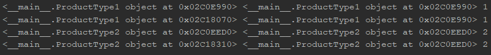
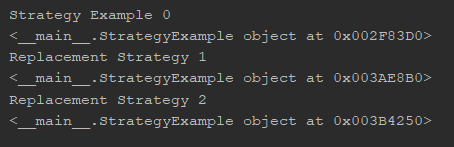
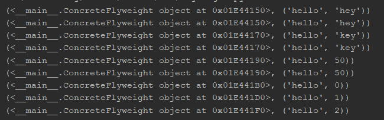
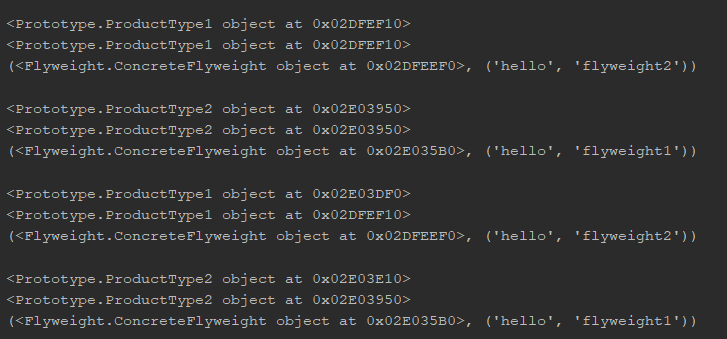
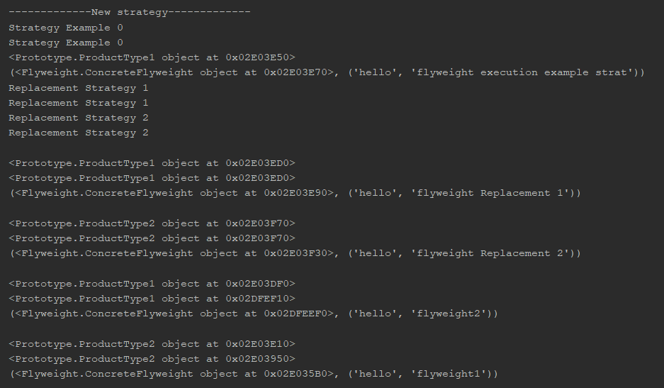

# IPP - Design Programming Patterns(python)
<details>
<summary> <b>Lab1</b> - Creational Patterns
</summary>

 
## Creational Patterns
- Abstract Factory
- Factory
- Singleton

## Abstract factory and Factory
MicrosoftServiceFactory and AppleServiceFactory(concrete factories) → Service factory(abstract factory)
```python3
class ServiceFactory:
    def getHumanResources(self): pass

    def getApplications(self): pass

    def getDelivery(self): pass


class MicrosoftServiceFactory(ServiceFactory):
    def getHumanResources(self):
        return MicrosoftHumanResources()

    def getApplications(self):
        return MicrosoftApplications()

    def getDelivery(self):
        return MicrosoftDelivery()


class AppleServiceFactory(ServiceFactory):
    def getHumanResources(self):
        return AppleHumanResources()

    def getApplications(self):
        return AppleApplications()

    def getDelivery(self):
        return AppleDelivery()
```
## Singleton
Creates only a single instance of of an object
```python3
class Singleton(type):
    def __init__(cls, name, bases, attrs, **kwargs): # __init__(cls,...) where cls is classself 
        super().__init__(name, bases, attrs) 
        #The super function is used to gain access to inherited methods –
        #from a parent or sibling class – that has been overwritten in a class object.
        cls._instance = None

    def __call__(cls, *args, **kwargs): # __call__() call operator
        if cls._instance is None:
            cls._instance = super().__call__(*args, **kwargs)
        return cls._instance
```


```python3
class MicrosoftApplications(Service, metaclass=Singleton):
    def __init__(self):
        Service.__init__(self, "Microsoft", "Applications")


class MicrosoftDelivery(Service, metaclass=Singleton):
    def __init__(self):
        Service.__init__(self, "Microsoft", "Delivery")
```
The marked addresses of the object prove the Single instance of an object

</details>
<details>
<summary> <b>Lab2</b> - Structural Patterns & Behavioral Patterns
</summary>


## Structural Patterns & Behavioral Patterns
- Proxy
- State
- Decorator

## Proxy with States

Here i incapsulate the implementation and return a proxy of that implementatioon.
```python3
class Proxy:
    def __init__(self, imp):
        self.__implementation = imp

    def __getattr__(self, name):
        return getattr(self.__implementation, name)

```
After what, i take the implementation from proxy and change the implementation without losing the object memory allocation in another sense we just change the *state*.
```python3
class State(Proxy):
    def __init__(self, imp):
        super().__init__(imp)

    def changeImp(self, newImp):
        super().__init__(newImp)

    def __getattr__(self, name):
        return super().__getattr__(name)
```
## Decorator
In the following diagram i try to describe a coffee and the variations that can be applied to it also i will add the implemented object in a proxy:


```python3
print('----------Process----------proxy cappuccino')
cappuccino = ProxyState.State(Cappuccino())
print(cappuccino.getDescription(), ": $", cappuccino.getTotalCost())
print(cappuccino.__repr__())
print()
print('----------Process----------proxy cappuccino')
cappuccino.changeImp(Whipped(Decaf(Cappuccino())))
print(cappuccino.getDescription(), ": $", cappuccino.getTotalCost())
print(cappuccino.__repr__())
print()
print('----------Process----------proxy cappuccino')
cappuccino.changeImp(Decaf(Whipped(Cappuccino())))
print(cappuccino.getDescription(), ": $", cappuccino.getTotalCost())
print(cappuccino.__repr__())
print()
print('----------Process----------proxy test cappuccino')
test = Decaf(Whipped(Cappuccino()))
print(test.getDescription(), ": $", test.getTotalCost())
print(test.__repr__())
print()
print('----------Process----------')
Hyper = ExtraEspresso(Decaf(Dry(EspressoConPanna())))
print(Hyper.getDescription(), ": $", Hyper.getTotalCost())
print(Hyper.__repr__())
```

- The first 3 outputs show how i put the decorated object in a proxy the first one contains the declaration of proxy and the rest 2 i just change the objects in state of the same proxy.*The proof of this concept is that proxy object is using the same address.*
- In the rest 2 outputs i just demonstrate how the decorator works.


</details>
<details>
<summary> <b>Lab3</b> - Creational Patterns, Structural Patterns & Behavioral Patterns
</summary>

 
## Creational Patterns, Structural Patterns & Behavioral Patterns 
- Prototype
- Strategy
- Flyweight
- Façade

## Prototype

Prototype creates a clone of a method, which is why the address of both the real object and the clone is similar



### Implementation

```python3
class Prototype:
    """ Object, that can be cloned.
    This is just a base class, so the clone() method
    is not implemented. But all subclasses have to
    override it.
    """

    _type = None
    _value = None

    def clone(self):
        pass
    def getType(self):
        return self._type

    def getValue(self):
        return self._value


class ProductType1(Prototype):
    """ Concrete prototype.
    Implementation of Prototype. Important part is the
    clone() method.
    """

    def __init__(self, number):
        self._type = self
        self._value = number

    def clone(self):
        return copy.copy(self)


class ProductType2(Prototype):
    """ Concrete prototype. """

    def __init__(self, number):
        self._type = self
        self._value = number

    def clone(self):
        return copy.copy(self)
```

## Strategy
Strategy allows a change of algorithm at runtime.



### Implementation

```python3
class StrategyExample:
    def __init__(self, func=None):
        self.name = 'Strategy Example 0'
        if func is not None:
            self.execute = types.MethodType(func, self)

    def execute(self, flyweight_factory):
        print(self.name)
        # print(self)
        return F.printing("flyweight execution example strat", flyweight_factory)


def replace1(self, flyweight_factory):
    print('Replacement Strategy 1')
    # print(self)
    return F.printing("flyweight Replacement 1", flyweight_factory)


def replace2(self, flyweight_factory):
    print('Replacement Strategy 2')
    # print(self)
    return F.printing("flyweight Replacement 2", flyweight_factory)
```

## Flyweight

Flyweight ,uses sharing to support large numbers of fine-grained objects
efficiently, meaning its a way to make the application more efficient in memory management.



### Implementation

```python3
import abc


class FlyweightFactory:
    """
    Create and manage flyweight objects.
    Ensure that flyweights are shared properly. When a client requests a
    flyweight, the FlyweightFactory object supplies an existing instance
    or creates one, if none exists.
    """

    def __init__(self):
        self._flyweights = {}

    def get_flyweight(self, key):
        try:
            flyweight = self._flyweights[key]
        except KeyError:
            flyweight = ConcreteFlyweight()
            self._flyweights[key] = flyweight
        return flyweight


class Flyweight(metaclass=abc.ABCMeta):
    """
    Declare an interface through which flyweights can receive and act on
    extrinsic state.
    """

    def __init__(self):
        self.intrinsic_state = None

    @abc.abstractmethod
    def operation(self, extrinsic_state):
        pass


class ConcreteFlyweight(Flyweight):
    """
    Implement the Flyweight interface and add storage for intrinsic
    state, if any. A ConcreteFlyweight object must be sharable. Any
    state it stores must be intrinsic; that is, it must be independent
    of the ConcreteFlyweight object's context.
    """

    def operation(self, *extrinsic_state):
        return self, extrinsic_state
```

## Façade
A facade is an object that provides a simplified interface to a larger body of code, such as a class library, meaning in a way encapsulating more functions in one.
In Facade i also implemented the other 3 patterns(Flyweight,Strategy,Prototype).





### Implementation

```python3
def upfly(v, flyweight_factory):
    this = P.ProductType1(F.printing("flyweight2", flyweight_factory))
    this2 = P.ProductType2(F.printing("flyweight1", flyweight_factory))
    return v and this or this2


def upstr(v, str, flyweight_factory):
    this = P.ProductType1(str.execute(flyweight_factory))
    this2 = P.ProductType2(str.execute(flyweight_factory))
    return v and this or this2
```

</details>
