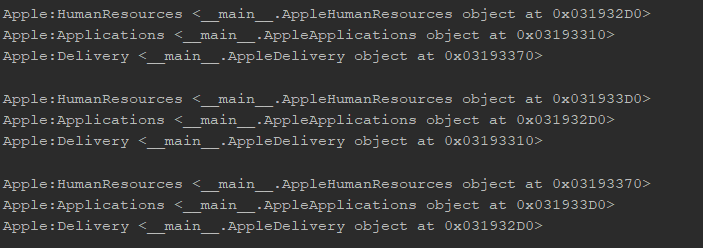
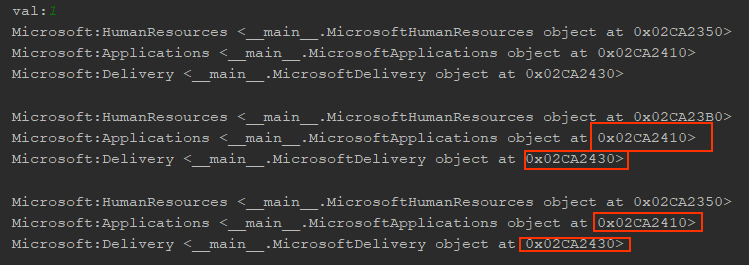

# IPP
<details>
<summary> <b>Lab1</b> - Creational Patterns
</summary>
 
## Creational Patterns
- Abstract Factory
- Factory
- Singleton

## Abstract factory and Factory
MicrosoftServiceFactory and AppleServiceFactory(concrete factories) → Service factory(abstract factory)
```python3
class ServiceFactory:
    def getHumanResources(self): pass

    def getApplications(self): pass

    def getDelivery(self): pass


class MicrosoftServiceFactory(ServiceFactory):
    def getHumanResources(self):
        return MicrosoftHumanResources()

    def getApplications(self):
        return MicrosoftApplications()

    def getDelivery(self):
        return MicrosoftDelivery()


class AppleServiceFactory(ServiceFactory):
    def getHumanResources(self):
        return AppleHumanResources()

    def getApplications(self):
        return AppleApplications()

    def getDelivery(self):
        return AppleDelivery()
```
## Singleton
Creates only a single instance of of an object
```python3
class Singleton(type):
    def __init__(cls, name, bases, attrs, **kwargs): # __init__(cls,...) where cls is classself 
        super().__init__(name, bases, attrs) 
        #The super function is used to gain access to inherited methods –
        #from a parent or sibling class – that has been overwritten in a class object.
        cls._instance = None

    def __call__(cls, *args, **kwargs): # __call__() call operator
        if cls._instance is None:
            cls._instance = super().__call__(*args, **kwargs)
        return cls._instance
```


```python3
class MicrosoftApplications(Service, metaclass=Singleton):
    def __init__(self):
        Service.__init__(self, "Microsoft", "Applications")


class MicrosoftDelivery(Service, metaclass=Singleton):
    def __init__(self):
        Service.__init__(self, "Microsoft", "Delivery")
```
The marked addresses of the object prove the Single instance of an object
</details>
<details>
<summary> <b>Lab2</b> - Structural design patterns & Behavioral design patterns
</summary>
 
## Structural design patterns & Behavioral design patterns
-Proxy
-Decorator
-State

## Proxy with States
work in progress

## Decorator
work in progress
</details>
